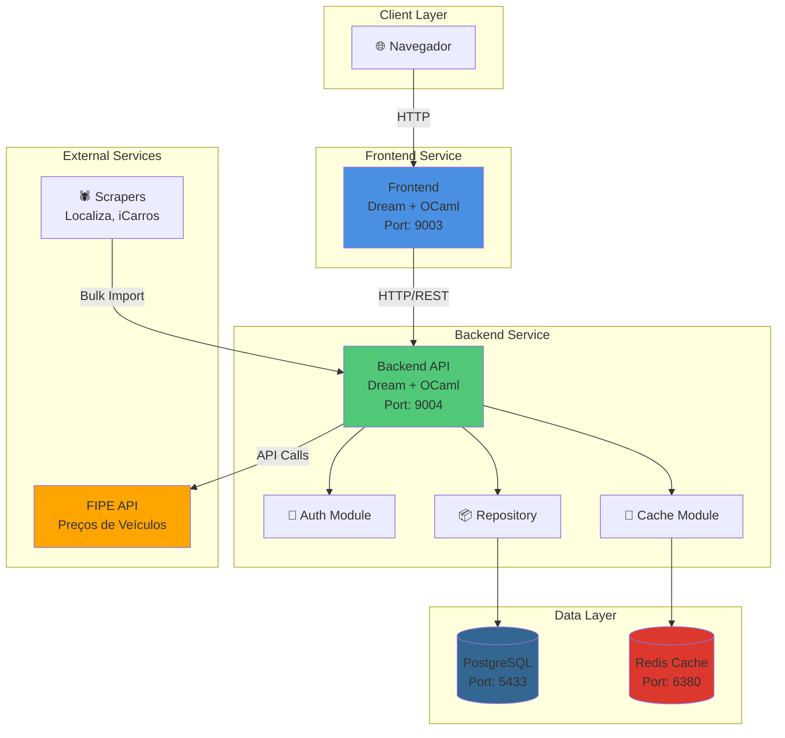
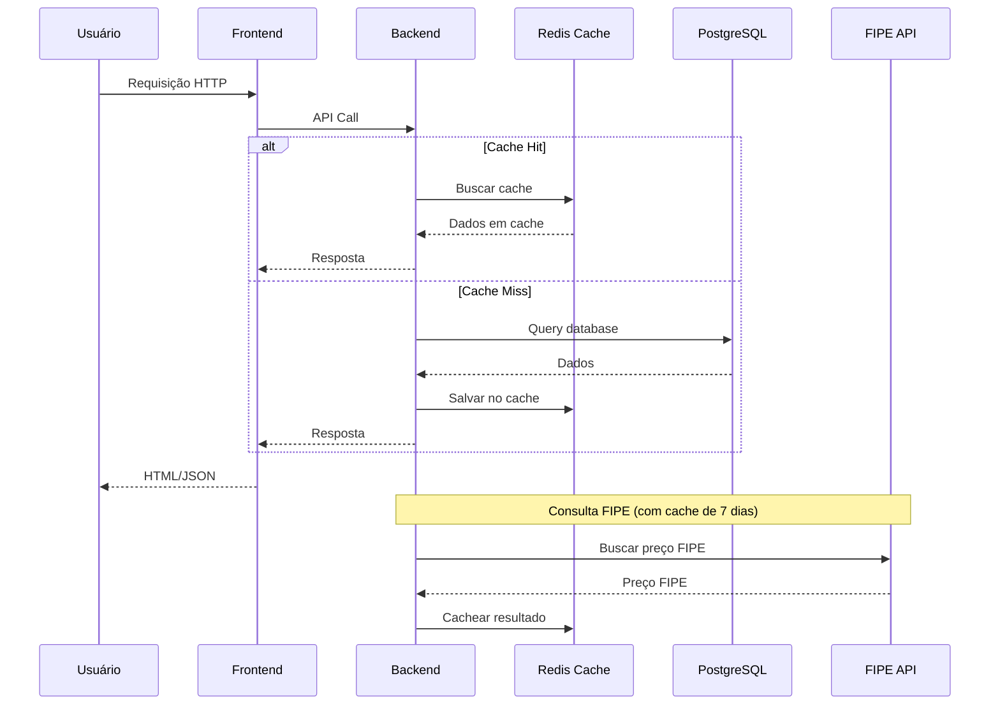
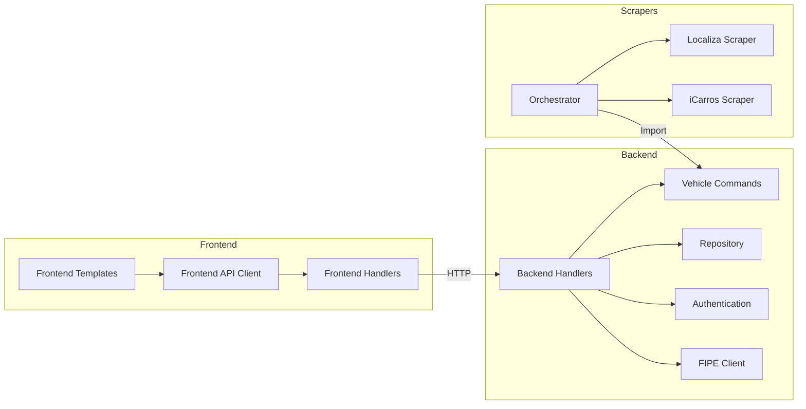
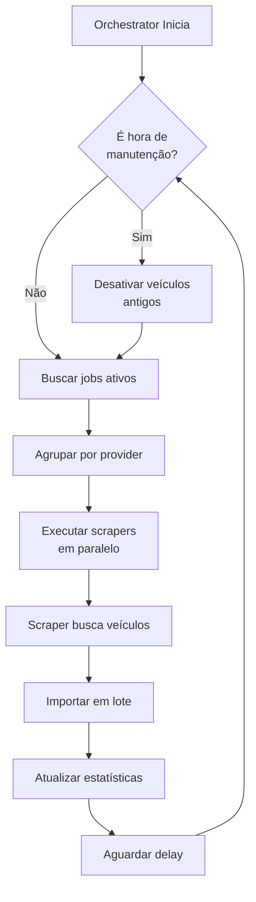

# BusCars - Plataforma de Busca de Veículos

Plataforma de marketplace de veículos para o mercado brasileiro, inspirada no Auto Tempest mas projetada especificamente para o Brasil. Combina funcionalidades de busca avançada com apresentação detalhada de veículos.

## 🚀 Quick Start

### Usando Docker Compose (Recomendado)

```bash
# Build e executar todos os serviços
docker-compose up --build

# Ou executar em background
docker-compose up -d --build

# Ver logs
docker-compose logs -f

# Parar serviços
docker-compose down
```

### Acessar a Aplicação

- **Frontend**: http://localhost:9003
- **Backend API**: http://localhost:9004
- **PostgreSQL**: localhost:5433
- **Redis**: localhost:6380

## 📐 Arquitetura do Sistema

### Visão Geral



### Fluxo de Dados



### Componentes Principais



## 🏗️ Estrutura do Projeto

```
buscar-mockup/
├── frontend/              # Servidor web frontend
│   ├── bin/
│   │   └── buscar.ml      # Servidor Dream + rotas
│   ├── lib/
│   │   ├── templates.ml    # Templates HTML
│   │   ├── api_client.ml # Cliente API backend
│   │   └── types.ml      # Tipos compartilhados
│   └── static/           # Assets estáticos
│
├── backend/              # API REST backend
│   ├── bin/
│   │   └── main.ml       # Servidor Dream + handlers
│   ├── lib/
│   │   ├── database.ml   # Queries Caqti
│   │   ├── cache.ml      # Cache Redis
│   │   ├── repository.ml # Camada de repositório
│   │   ├── vehicle_commands.ml # Comandos de veículos
│   │   ├── fipe.ml       # Cliente FIPE API
│   │   └── auth.ml       # Autenticação
│   └── db/
│       ├── schema.sql    # Schema PostgreSQL
│       └── seed.sql      # Dados iniciais
│
├── app-scrappers/        # Aplicação de scrapers
│   ├── lib/
│   │   ├── orchestrator.ml # Orquestrador de scrapers
│   │   └── scrapers/
│   │       ├── localiza.ml
│   │       └── icarros.ml
│   └── bin/
│       └── main.ml       # Entry point
│
└── docker-compose.yml    # Orquestração Docker
```

## 🔄 Fluxo de Scraping



## 🚀 Deploy

### Desenvolvimento
```bash
docker-compose up --build
```

### Produção
```bash
# Usar profile production
docker-compose --profile production up -d

# Inclui:
# - Cloudflare Tunnel
# - Nginx Proxy
# - Scrapers
```